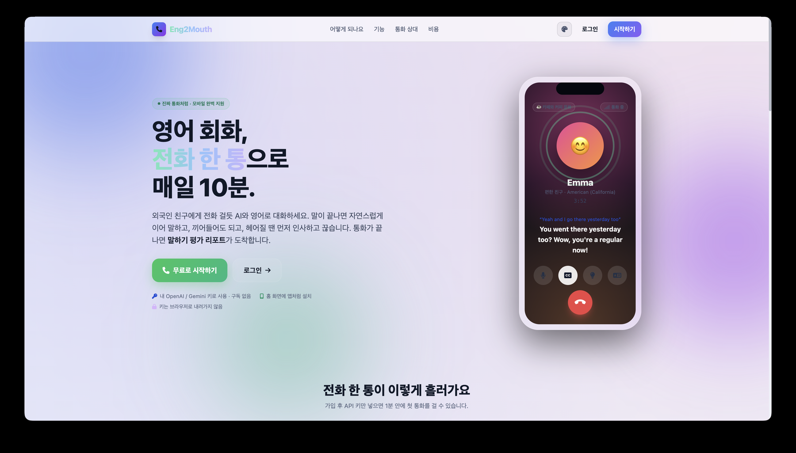
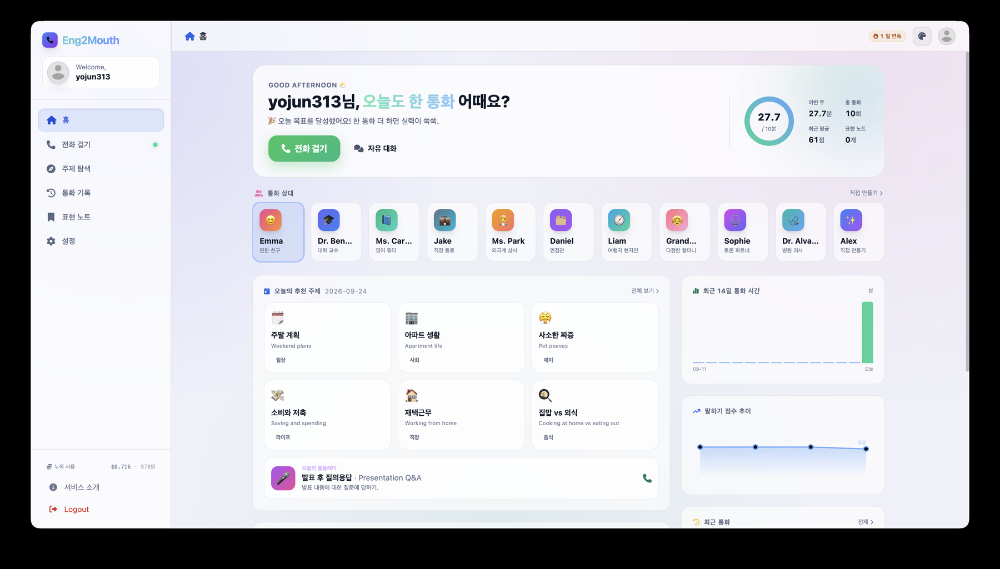
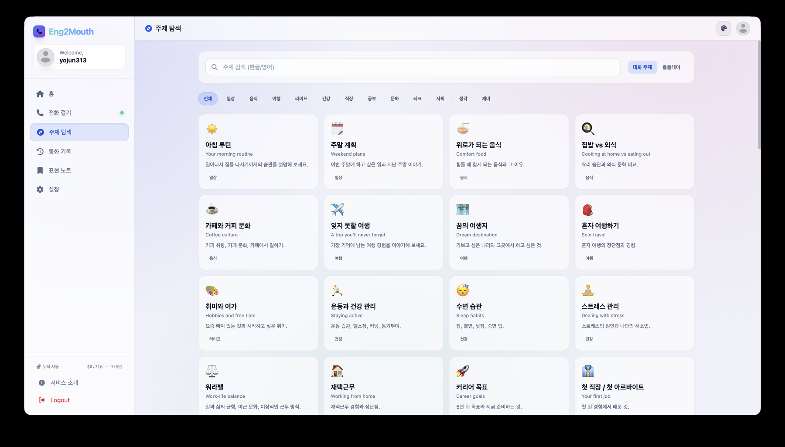
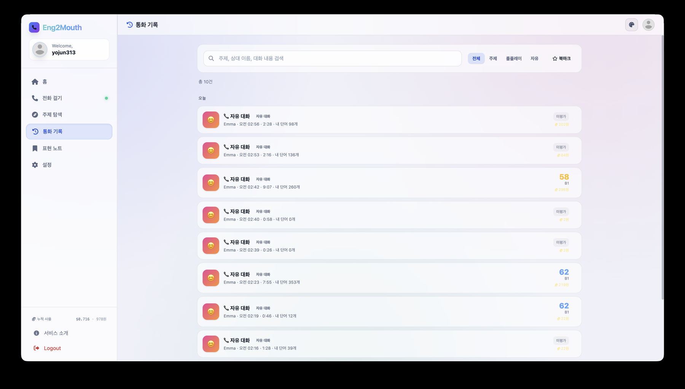

# Eng2Mouth

Practice English speaking by **talking on the phone with an AI partner** that sounds and behaves like a real person. Pick who you want to call (a casual friend, a professor, an interviewer, a hotel receptionist…), choose today's topic, and dial. When you hang up, you get a speaking evaluation report with a score, CEFR level, corrections, and useful expressions to review later.

Built as a mobile-first web app (installable as a PWA), using **OpenAI Realtime** or **Google Gemini Live** with each user's own API key. No subscription, no middleman.






---

## 1. Features

* **Real phone-call experience**: ringback tone, vibration on connect, screen wake lock, voice-reactive avatar, natural interruptions, and the partner hangs up by itself after saying goodbye (`end_call` tool). The partner never says it is an AI and speaks with fillers, backchannels and short turns.
* **Two voice providers, chosen per call**: OpenAI `gpt-realtime` (WebRTC) or Google Gemini Live (WebSocket). The dial screen shows the estimated cost per 10 minutes for each provider and model; the choice (provider, voice model, voice, evaluation model, level, correction style, turn mode) is saved to the user's profile in MongoDB as the default for the next call.
* **11 personas**: casual friend, professor, ESL tutor, coworker, manager, interviewer, local guide, grandma, debate partner, doctor, plus a fully custom persona described in free text.
* **Daily topics**: 6 topics rotate every day from a bank of 60, plus a roleplay scenario of the day (16 scenarios), GPT-generated personal recommendations based on your history, custom topics and free talk.
* **In-call assists**: live captions, hints ("say it like this" with Korean meaning), translation of the last sentence, "say it again slowly", typed input, hold, mute, and push-to-talk mode for noisy places.
* **Speaking evaluation report**: overall score, CEFR level, fluency / grammar / vocabulary / coherence / interaction, strengths, improvements, corrected sentences, expressions worth stealing, filler-word analysis, goals for the next call.
* **Phrasebook & review quiz**: save expressions from reports, listen to them with TTS, review with flashcards.
* **Call history**: full transcripts with per-sentence translation, search, filters, bookmarks, notes, re-dial the same topic. Costs are shown in USD and KRW (daily exchange rate).
* **Dashboard**: streak, daily goal ring, 14-day talk time, score trend, recent calls.
* **Accounts & settings**: email-verified sign-up, per-user OpenAI / Gemini keys (never sent to the browser), profile image, level, correction style, voices, speaking speed, model selection, usage tracking, data export, account deletion.
* **Same theme system as LecAI**: Aurora / Gradient Mesh / Apple Glass / Minimal Flat, dark & light mode, mobile bottom tab bar, safe-area aware layout.

---

## 2. System Requirements

The server itself is a plain FastAPI app; all speech processing happens on the provider side, so no GPU or media tooling is required.

* **Python 3.12+** (developed on 3.14, managed with [uv](https://docs.astral.sh/uv/)).
* **MongoDB** for users, sessions, calls, phrases and daily picks.
* **HTTPS in production**: browsers only allow microphone access on `https://` (or `localhost`).
* Each user needs their own **OpenAI API key** and/or **Google Gemini API key** (Gemini has a free tier in AI Studio).

---

## 3. Installation

### 1) Install uv (Ubuntu / Debian)

```bash
curl -LsSf https://astral.sh/uv/install.sh | sh
```

### 2) Setup Python Environment

```bash
git clone https://github.com/yojun313/eng2mouth.git
cd eng2mouth

uv sync
source .venv/bin/activate
```

### 3) Configuration

Create a `.env` file in the root directory. There exists `.env.example` in root directory.

| Key | Description |
|---|---|
| `PORT` | HTTP port (default `7005`) |
| `MONGO_HOST`, `MONGO_PORT`, `MONGO_DB`, `MONGO_USERNAME`, `MONGO_PASSWORD` | MongoDB connection (`authSource=admin`) |
| `SECRET_KEY` | Session secret |
| `MAIL_SENDER`, `MAIL_PASSWORD` | Gmail SMTP for sign-up verification codes. If empty, sign-up works without email verification |
| `SIGNUP_REQUIRE_EMAIL` | `true` to require email verification when mail is configured |
| `REALTIME_MODEL`, `REALTIME_MINI_MODEL` | OpenAI voice models (default `gpt-realtime-2.1`, `gpt-realtime-2.1-mini`) |
| `CHAT_MODEL` | OpenAI model for evaluation / hints / translation / topic generation (default `gpt-5.6-luna`) |
| `TRANSCRIBE_MODEL`, `TTS_MODEL`, `DEFAULT_VOICE` | OpenAI input transcription, phrase TTS, default voice |
| `GEMINI_LIVE_MODEL` | Gemini Live model (default `gemini-3.8-live`). If the key cannot access it, the newest available `live` / `native-audio` model is picked automatically |
| `GEMINI_CHAT_MODEL`, `GEMINI_FAST_MODEL`, `GEMINI_TTS_MODEL`, `GEMINI_DEFAULT_VOICE` | Gemini evaluation / fast tasks / TTS models and default voice |
| `GEMINI_ALLOW_DIRECT_KEY` | Fallback that passes the raw key to the browser when ephemeral tokens cannot be minted (default `false`) |
| `USD_KRW` | Fallback exchange rate used when the daily rate lookup fails (default `1400`) |

Model names are only defaults. When a configured model is unavailable for a user's key (for example, retired for new users), the server falls back to the newest model the key can access and remembers the rejected one for the process lifetime.

### 4) Run the Server

```bash
python3 run.py
```

The app is served on `http://0.0.0.0:7005`. For phones, put it behind an HTTPS reverse proxy (nginx / Caddy) and add it to the home screen for a full-screen, app-like call UI.

---

## 4. How a Call Works

1. `POST /api/calls/start`: the server builds the persona / level / topic / correction-style instructions and mints a short-lived token with the user's key: an OpenAI Realtime client secret (10 min) or a Gemini `v1alpha` ephemeral auth token (single use). The selected options are stored as the user's defaults.
2. The browser connects **directly** to the provider: OpenAI via WebRTC (`/v1/realtime/calls`), Gemini via WebSocket (`BidiGenerateContentConstrained`, PCM16 16 kHz up / 24 kHz down). Gemini playback is routed through a local WebRTC loopback so the browser's echo canceller works on speakerphone. The real API key never reaches the client.
3. Captions, usage metadata and the `end_call` tool arrive over the data channel / socket and drive the same call UI for both providers.
4. On hang-up, `POST /api/calls/{id}/finish` stores the transcript, duration, token usage and estimated cost; `POST /api/calls/{id}/evaluate` produces the structured report (JSON schema enforced) and adds its cost to the call.

---

## 5. Project Structure

```
app/
  main.py                FastAPI app, static files, PWA manifest / service worker
  core/config.py         Settings, voices, levels, model lists
  db/                    MongoDB collections (users, sessions, calls, phrases, daily_picks)
  routes/
    view_routes.py       Pages (landing, dashboard, call, topics, history, phrases, settings)
    auth_routes.py       Sign-up (email code), login, logout
    user_routes.py       Settings, API-key verification, model list, profile, export, delete
    call_routes.py       Start / finish / evaluate / list / detail / bookmark / note
    topic_routes.py      Daily topics, personal recommendations, personas
    assist_routes.py     Hints, translation, TTS
    phrase_routes.py     Phrasebook CRUD
    stats_routes.py      Dashboard statistics
  services/
    prompts.py           Persona-as-a-real-person instructions, evaluation prompt & schema
    personas.py          Persona catalogue
    topics.py            Topic bank, roleplay scenarios, daily rotation
    openai_service.py    Realtime client secrets, chat JSON, TTS, model fallback
    gemini_service.py    Live ephemeral tokens, generateContent JSON, TTS, model fallback
    llm.py               Provider dispatcher for text tasks and TTS
    call_service.py      Stats, evaluation orchestration, dashboard aggregation
    pricing.py           Cost estimation (USD) and KRW conversion
  templates/             Jinja2 pages (base layout + pages)
static/
  shared/                app.css, theme.css, theme.js (shared theme system)
  icons/, manifest.webmanifest, sw.js
```

---

## 6. Cost Reference (estimates, per 10-minute call)

| Provider / model | Estimated cost |
|---|---|
| Google Gemini Live | $0.12 – $0.32 (free within the AI Studio free tier) |
| OpenAI `gpt-realtime-2.1-mini` | $0.12 – $0.16 |
| OpenAI `gpt-realtime-2.1` | $0.32 – $0.45 |
| Evaluation report | about $0.003 (Gemini Flash) to $0.01 (GPT) |

Estimates are based on public list prices; the app shows the actual token usage of each call converted to USD and KRW, but the provider's billing dashboard is the source of truth.
